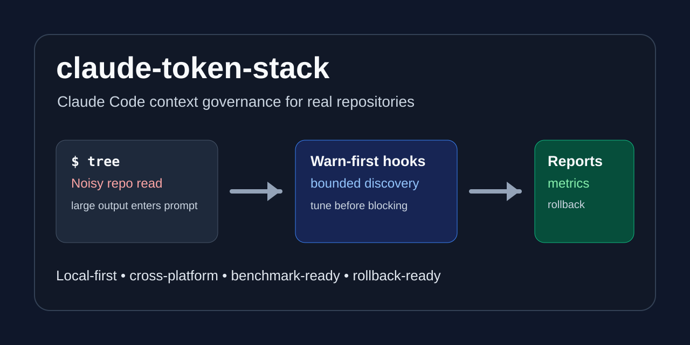

# claude-token-stack

[](https://github.com/lliangcol/claude-token-stack/actions/workflows/ci.yml)
[](LICENSE)
[](package.json)
[](templates/.claude/settings.json)

Repo-level Claude Code token governance kit for teams that want agent work to be bounded, measurable, reversible, and cross-platform.

`claude-token-stack` scaffolds warn-first hooks, project policy, MCP guidance, verification reports, synthetic benchmark helpers, and rollback docs into a repository. It is useful when Claude Code or other AI coding agents repeatedly work in the same repo and you need evidence before changing team behavior.

[中文说明](README_zh-CN.md) | [30-second demo](docs/demo.md) | [examples](examples/README.md) | [v0.1.0-rc checklist](https://github.com/lliangcol/claude-token-stack/blob/main/docs/release/v0.1.0-rc-checklist.md)



## 30-Second Demo

From a local checkout:

```bash
npm install
node bin/cts.js scaffold --target .tmp/demo-review
node bin/cts.js verify --target .tmp/demo-review
```

Warn-first shell guard:

```json
{"command":"tree","violations":["Avoid raw tree. Use targeted rg --files with a narrow path."],"mode":"warn"}
```

Broad code-discovery gate after explicit block-mode tuning:

```json
{"tool_name":"Grep","mode":"block","block_reasons":["broad Grep path","broad Grep glob"]}
```

Synthetic benchmark summary:

```text
recommend_enter_block: false
evidence_modes: synthetic-only
recommendation_note: synthetic-only evidence cannot recommend block mode
```

This demo proves wiring only: policy, hooks, logs, reports, benchmark commands, and rollback are connected. It is not proof of real token or cost savings. See [docs/demo.md](docs/demo.md) and the copyable demo repositories under [examples/](examples/README.md).

## Who It Is For

Use this when you:

- maintain a repository where Claude Code or AI coding agents are used repeatedly;
- need repo-local policy instead of a one-off prompt-shortening trick;
- want warn-first adoption before any block-mode enforcement;
- need verification and benchmark artifacts before changing team defaults;
- work across Windows PowerShell, Git Bash, WSL2, macOS, or Linux;
- want rollback instructions before adoption becomes sticky.

This is probably not the right tool if you only need a single token compression command, a generic linter, a hosted analytics service, or a fixed savings promise.

## What It Is Not

`claude-token-stack` is not a single-purpose token compression tool. It is the repository operating layer around agent context behavior.

It does not guarantee a fixed token or cost reduction percentage. Any savings number should come from one of these evidence types and be labeled accordingly:

- a synthetic demo or benchmark report;
- a controlled benchmark on representative tasks;
- a real case report with baseline/post evidence files.

Do not publish estimated savings or unmeasured percentages as project claims.

## Real Proof

The current repository includes synthetic/demo evidence only. That is enough to show that the governance loop works, but not enough to claim real-world savings.

| Signal | Demo result | Meaning |
| --- | --- | --- |
| Noisy shell command | `tree` produces a warn-mode violation | The shell guard catches high-context commands without blocking first adoption. |
| Broad code search | broad `Grep` with `path="."` and `glob="**/*"` blocks in block mode | The code-discovery gate can enforce bounded search after tuning. |
| Metrics decision | `recommend_enter_block: false` | Synthetic data alone is not enough to recommend stricter rollout. |
| Generated artifacts | `.claude/logs/*` and `.token-stack/reports/*` | Adoption produces local evidence that can be reviewed or deleted. |

Evidence files commonly include:

- `.token-stack/reports/verify-report.md`
- `.token-stack/reports/verify-report.json`
- `.token-stack/reports/baseline/*.json`
- `.token-stack/reports/post/*.json`
- `.token-stack/reports/metrics-summary.json`
- `.token-stack/reports/metrics-summary.md`

See [docs/case-studies/synthetic-demo.md](docs/case-studies/synthetic-demo.md) for the case-study format used by this RC.

## Quickstart

Try from a local checkout:

```bash
npm install
node bin/cts.js scaffold --target /path/to/your-repo
node bin/cts.js doctor --target /path/to/your-repo --no-write
node bin/cts.js verify --target /path/to/your-repo
```

After an npm release is available:

```bash
npx claude-token-stack scaffold
npx claude-token-stack doctor --no-write
npx claude-token-stack verify
```

Default posture:

- warn-first, not block-first;
- offline-first and local-first;
- remote optional installs disabled unless explicitly enabled;
- benchmark-ready so adoption can be measured;
- rollback-ready so changes can be undone cleanly.

## What You Get

`claude-token-stack` scaffolds:

- **Policy**: project-local Claude Code token and context rules.
- **Hooks**: warn-first guards for noisy shell commands, broad reads, greps, and globs.
- **MCP guidance**: bounded discovery guidance and duplicate MCP avoidance.
- **Verification**: scripts and reports to confirm the stack is installed correctly.
- **Benchmarking**: baseline/post metrics for adoption decisions.
- **Rollback**: backups, disable modes, and removal instructions.

Core files and behavior include:

- `.claude/settings.json`, `.claude/token-policy.md`, hooks, output style guidance, and rollback docs;
- `bash-token-guard.py` for high-noise Bash command warnings;
- `cbm-gate.py` for broad `Read`, `Grep`, and `Glob` warnings;
- `run-python-hook.js` for Windows, WSL2, macOS, Linux, Git Bash, and PowerShell hook execution;
- optional guidance for RTK, Headroom, Caveman, context-mode, codebase-memory-mcp, and local MCP setup;
- verification and benchmark artifacts under `.token-stack/reports/`.

## Recommended Rollout

Start in warn mode and collect evidence:

```bash
export TOKEN_GUARD_MODE=warn
export CBM_GATE_MODE=warn
export ENABLE_HEADROOM=0
```

Defaults in `templates/.claude/settings.json` follow the same posture:

```json
{
  "TOKEN_GUARD_MODE": "warn",
  "CBM_GATE_MODE": "warn",
  "CBM_GATE_BLOCK_TOOLS": "Grep,Glob",
  "ENABLE_HEADROOM": "0"
}
```

Consider blocking only after:

- hook smoke tests pass in warn and block modes;
- `metrics-summary.json` recommends entering block mode;
- post-adoption tasks still pass;
- raw large-output events are not worse than baseline;
- cost or token metrics are not worse than baseline;
- false positives in `.claude/logs/token-guard.log` and `.claude/logs/cbm-gate.log` have been reviewed.

A conservative path is to switch `TOKEN_GUARD_MODE=block` first, keep `CBM_GATE_MODE=warn`, and evaluate broad `Grep`/`Glob` blocking later. Test and build commands remain warn-only advisories in the default hook even when block mode is enabled.

## Verification And Benchmark

Repository checks:

```bash
npm run check:native
npm test
npm pack --dry-run
```

Native diagnostics and hook audit:

```bash
node bin/cts.js doctor --target . --json --no-write
node bin/cts.js audit-hooks --target . --json --no-write
```

Synthetic baseline/post workflow:

```bash
node bin/cts.js benchmark synthetic-only --target .
node bin/cts.js collect-metrics .token-stack/reports
node bin/cts.js compare-metrics .token-stack/reports
```

Context, log, usage, and local event helpers:

```bash
node bin/cts.js pack-context --target . --budget 60000
node bin/cts.js analyze-logs --target .
node bin/cts.js ingest-usage --target .
node bin/cts.js events record --target . --type rollout --message "warn-mode smoke complete"
node bin/cts.js preset --target . --name balanced --json --no-write
```

The benchmark workflow is for adoption decisions. It can read `.token-stack/benchmark.config.json`; see [docs/operations.md](docs/operations.md) and [docs/examples/benchmark.config.example.json](docs/examples/benchmark.config.example.json). It should not be turned into a public savings claim without representative baseline/post evidence.

## Cross-Platform Notes

macOS and Linux can run Bash scripts directly:

```bash
bash bin/install-claude-token-stack.sh scaffold
bash bin/verify-claude-token-stack.sh
bash bin/run-token-benchmark.sh synthetic-only
```

Windows users should prefer the Node CLI from PowerShell for scaffold, doctor, audit-hooks, pack-context, analyze-logs, ingest-usage, collect-metrics, compare-metrics, and direct hook smoke tests:

```powershell
node .\bin\cts.js scaffold --target .
node .\bin\cts.js doctor --target . --no-write
powershell -ExecutionPolicy Bypass -File .\bin\fix-windows-claude-settings.ps1 -DryRun
```

`verify`, `benchmark`, `install-tools`, and `all` invoke Bash scripts even when started through the Node CLI. Run those commands from Git Bash/WSL2, or install Git Bash and keep target paths quoted.

PowerShell does not support Bash heredoc syntax such as `python - <<'PY'`. Use the Node CLI or run Bash scripts inside Git Bash/WSL2.

## Tool Strategy

- `codebase-memory-mcp`: preferred code discovery route for symbols, callers, callees, snippets, and architecture when indexed.
- `context-mode`: large output governance for logs and long command output.
- `Caveman`: optional concise output style/tooling. If unavailable, use `.claude/output-styles/token-lean.md`.
- `Headroom`: disabled by default. Enable only with `ENABLE_HEADROOM=1` after agreeing to setup, measurement, and rollback.
- `RTK`: optional. Native Windows, Git Bash, MINGW, MSYS, and Cygwin skip RTK auto-install by default if it is not already installed.
- `codegraph`: optional duplicate MCP. If both `codebase-memory-mcp` and `codegraph` exist, prefer codebase-memory-mcp and remove codegraph if it creates duplicate context.

Project-local MCP setup is optional. Start from `.mcp.local.example.json`, pin reviewed versions, avoid duplicate global/project servers, and record tool-list, connection, cache, rate-limit, read-only, and stability evidence with `docs/mcp-local-smoke.md`.

## Rollback

Fast disable:

```bash
export TOKEN_GUARD_MODE=off
export CBM_GATE_MODE=off
```

PowerShell:

```powershell
$env:TOKEN_GUARD_MODE = "off"
$env:CBM_GATE_MODE = "off"
```

Scaffold creates `.bak.*` backups before changing an existing `.claude/settings.json` or overwriting copied template destinations. To roll back:

1. Restore the relevant `.claude/settings.json.bak.*` file.
2. Remove copied hook files from `.claude/hooks/`.
3. Remove `.claude/token-policy.md` and `.claude/output-styles/token-lean.md` if they were only used for this stack.
4. Remove optional MCP servers added during tool installation, especially duplicate `codegraph`.
5. Keep `.token-stack/reports/` if you need adoption evidence; otherwise remove generated reports and logs.

See [docs/rollback.md](docs/rollback.md) and [docs/claude-token-stack-rollback.md](docs/claude-token-stack-rollback.md).

## RC / Release CTA

This repository is being prepared for the GitHub `v0.1.0-rc` surface. Useful next actions:

- try one static demo under [examples/](examples/README.md);
- run `npm test` and `npm pack --dry-run`;
- review the [v0.1.0-rc checklist](https://github.com/lliangcol/claude-token-stack/blob/main/docs/release/v0.1.0-rc-checklist.md);
- file issues for false positives, Windows path behavior, benchmark gaps, and documentation gaps.

No npm publish is required for this RC preparation pass.

## FAQ

### Is this a token compression tool?

No. It is a repo-level governance toolkit for Claude Code and AI coding agents. It focuses on policy, hooks, MCP guidance, verification, benchmark, and rollback.

### Does it guarantee token reduction?

No. It helps detect and measure avoidable context waste. Real impact depends on repository size, workflow, agent behavior, and adoption mode.

### Why warn-first?

Broad commands and large reads are sometimes legitimate during incident response or unfamiliar repo exploration. Warn-first mode lets teams collect evidence and tune false positives before blocking.

### Does it require remote tools?

No. The default path is local-first. Optional tools require explicit opt-in.

### Can I use only scaffold without optional tools?

Yes. `scaffold` and `verify` work without remote installers. Optional tools are detection/install guidance only.

### Can I use it on Windows?

Yes. The Node CLI and hook wrappers are designed for cross-platform use, including PowerShell, Git Bash, WSL2, macOS, and Linux.

## Roadmap

Planned areas:

- real case-study reports with anonymized evidence;
- more hook smoke tests across Windows, macOS, Linux, Git Bash, and WSL2;
- clearer MCP deduplication guidance;
- improved metrics summaries for maintainers;
- optional templates for team rollout documentation;
- more examples for open-source and enterprise repository adoption.

See [ROADMAP.md](ROADMAP.md) for details.

## Contributing

Contributions are welcome, especially:

- real benchmark reports with anonymized data;
- Windows, macOS, Linux, Git Bash, and WSL2 compatibility fixes;
- hook false-positive reductions;
- MCP guidance improvements;
- documentation examples from real adoption paths;
- security and rollback review.

Start with:

```bash
npm install
npm test
```

Please read [CONTRIBUTING.md](CONTRIBUTING.md) before opening a pull request.

## Security

`claude-token-stack` does not intentionally read secrets and does not require uploading repository data.

The default setup is local-first. Remote optional tool installation is disabled unless explicitly enabled:

```bash
TOKEN_STACK_ALLOW_REMOTE_INSTALL=1 \
CONTEXT_MODE_NPM_SPEC=context-mode@1.2.3 \
CODEBASE_MEMORY_MCP_NPM_SPEC=codebase-memory-mcp@1.2.3 \
npx claude-token-stack install-tools
```

Remote npm/npx installs require exact semver package specs by default. `package@latest` is not pinned. Set `TOKEN_STACK_ALLOW_UNPINNED_REMOTE_INSTALL=1` only in disposable or otherwise reviewed environments.

This is not a full DLP system. Review generated policies, extend deny lists for project-specific secrets, and avoid including credentials, `.env` content, private keys, or production tokens in benchmark reports.

For details, see [SECURITY.md](SECURITY.md).

## Documentation

- [Getting Started](docs/getting-started.md)
- [Installation](docs/installation.md)
- [Architecture](docs/architecture.md)
- [Benchmark](docs/benchmark.md)
- [Operations](docs/operations.md)
- [Demo](docs/demo.md)
- [Examples](examples/README.md)
- [Case Studies](docs/case-studies/README.md)
- [Demo Repo Plans](docs/demo-repo-plans.md)
- [Validation Playbook](docs/validation-playbook.md)
- [Rollback](docs/rollback.md)
- [Security Model](docs/security-model.md)
