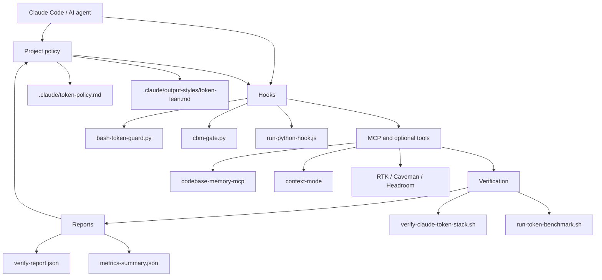

# Architecture

`claude-token-stack` is a project-local governance layer for Claude Code usage. It does not replace Claude Code. It adds policy, hooks, optional tool installers, validation, benchmark reports, and rollback guidance around an existing repository.



## Project Policy

The scaffold copies `.claude/token-policy.md` into the target repository and merges hook configuration into `.claude/settings.json`. The policy makes token governance explicit:

- Prefer graph or symbol discovery before whole-file reads.
- Avoid unbounded shell output.
- Keep generated, vendor, build, lock, and secret-like paths out of context.
- Start in `warn`, collect evidence, then decide whether to block.
- Keep optional tools optional and reversible.

## Hooks

Claude Code `PreToolUse` hooks are the first enforcement layer.

- `bash-token-guard.py` inspects Bash tool commands and warns or blocks high-noise patterns such as `tree`, `ls -R`, `grep -R`, broad `find`, raw source `cat`, and unbounded `docker logs` or `kubectl logs`.
- `cbm-gate.py` inspects `Read`, `Grep`, and `Glob`. It warns when source or noisy paths are read before code discovery and can block broad `Grep`/`Glob` in block mode.
- `run-python-hook.js` launches Python without shell interpolation and tries the right Python command per platform.

Both hook families default to `warn`. Exit code `0` allows the tool call. Exit code `2` blocks when the relevant mode is set to `block`.

## MCP

`codebase-memory-mcp` is the default code discovery MCP. Use it for functions, classes, callers, callees, snippets, and architecture before broad file search.

`context-mode` is a large-output governance MCP. Use it for logs and large command output that must be summarized or routed safely.

`codegraph` is treated as optional and potentially duplicative when codebase-memory-mcp is already present. See [MCP Deduplication](mcp-deduplication.md).

## Tool Installers

`bin/install-claude-token-stack.sh` supports `preflight`, `scaffold`, `tools`, and `all`.

Installer principles:

- Scaffold works offline.
- Remote installs are disabled unless `TOKEN_STACK_ALLOW_REMOTE_INSTALL=1`.
- Remote npm/npx installs require pinned package specs by default, unless `TOKEN_STACK_ALLOW_UNPINNED_REMOTE_INSTALL=1` is explicitly set.
- Remote shell installer scripts are downloaded and hashed for audit only; the project does not execute unpinned shell installers and does not use `curl | sh`.
- RTK auto-install is skipped on Windows/MINGW/MSYS/Cygwin.
- Headroom is disabled unless `ENABLE_HEADROOM=1`.

The Node CLI in `bin/cts.js` wraps Bash and Python entrypoints and handles Windows path conversion for common workflows.

## Verification

Verification checks that the scaffold is structurally usable:

- Required files exist.
- `.claude/settings.json` parses as JSON.
- Hook runner parses under Node.
- Python hooks compile.
- Warn-mode hooks exit `0`.
- Block-mode hook smoke cases exit `2`.
- Optional tools are detected or recorded as warnings.

The main command is:

```bash
node bin/cts.js verify --target .
```

## Reports

Reports are written under `.token-stack/reports/`:

- `install-report.json`: installer/preflight/tool status.
- `verify-report.md`: human-readable verification report.
- `verify-report.json`: machine-readable verification report.
- `baseline/*.json` and `post/*.json`: benchmark task outputs.
- `metrics-collected.json`: aggregated raw metrics.
- `metrics-summary.json`: baseline/post comparison and block recommendation.

Runtime hook logs are written under `.claude/logs/`.

## Why Warn First

Warn-first is the default because token governance has real false-positive risk. A broad search can be justified during an incident, first-time repo orientation, or migration. Blocking before measurement can slow work without proving savings.

The intended sequence is:

1. Scaffold in warn mode.
2. Run verification.
3. Collect baseline/post benchmark data.
4. Review hook logs and false positives.
5. Enable block only for rules that are stable in the target repo.
